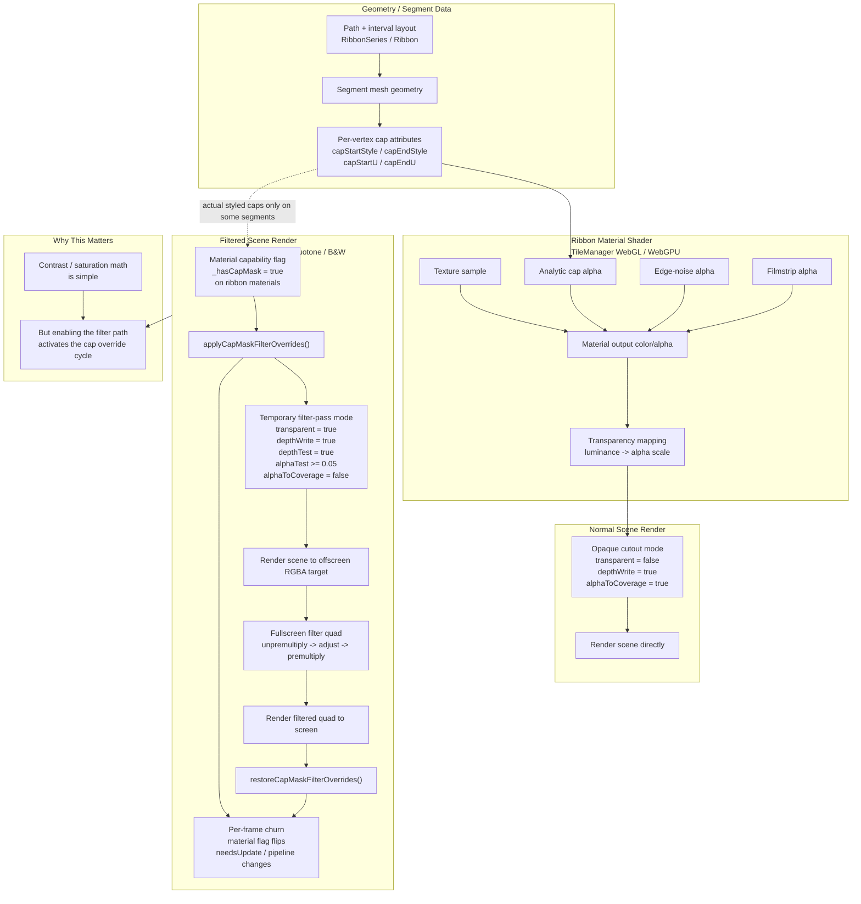

# Filter Cap-Mask Architecture

This note captures the current viewer shader architecture around ribbon cap masks, transparency mapping, and fullscreen post-process filters.

## Notes

- Ribbon materials are normally authored as opaque alpha cutouts with alpha-to-coverage, so cap edges participate in the normal depth pipeline.
- The fullscreen filter path expects a resolved RGBA scene texture and unpremultiplies it before applying contrast, saturation, duotone, or black-and-white transforms.
- To preserve cap-edge behavior in the filtered path, the current implementation temporarily switches cap-masked materials away from alpha-to-coverage and into an alpha-tested blended mode for the offscreen pass, then restores the original flags afterward.
- Because contrast and saturation now activate that same filtered path, they inherit the cap-mask override cost even though the color math itself is lightweight.
