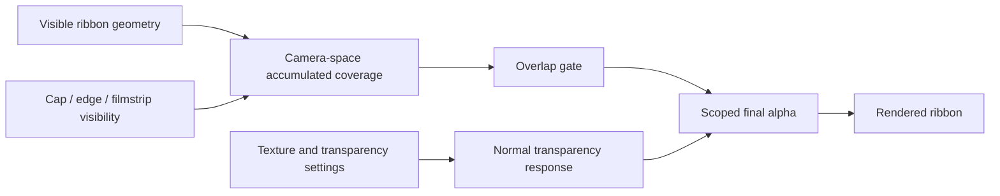

# Overlap-only transparency

## What it does

Overlap-only transparency makes transparency a spatial effect instead of a property of the entire ribbon.

When transparency is enabled normally, the selected transparency settings can affect every visible part of the ribbon. When **Overlap-only transparency** is also enabled, areas that appear as a single ribbon layer remain opaque. The existing transparency response is applied only where visible ribbon geometry accumulates in the camera view.

Self-overlap counts: a ribbon can produce the effect by crossing or folding over itself, even when there is only one ribbon object.

## Why it matters artistically

This option preserves the presence and readability of isolated ribbon surfaces while opening up layered areas. It can make crossings, knots, folds, and woven passages feel spatially connected without washing out the rest of the composition.

The result is a useful middle ground between an opaque material and a globally translucent material:

- single-layer regions retain solid color, texture, and silhouette;
- overlapping regions can reveal depth relationships and material layers;
- crossings become visual points of emphasis rather than transparency being applied everywhere.

In practice, this turns transparency into a compositional tool. It can help direct attention, separate foreground from background, and give a tumble or flow a sense of depth while keeping the overall form legible.

## Suggested workflow

1. Enable transparency and establish the desired transparency basis, range, highlights, and shadows with overlap-only disabled.
2. Enable **Overlap-only transparency** to restrict that response to overlapping areas.
3. Adjust the normal transparency settings to control how strongly the overlaps reveal what is behind them.
4. Enable **Show overlap mask (debug)** when investigating the result. The temporary debug view displays the accumulated camera-space overlap coverage as a grayscale mask.
5. Check the result from the intended camera and during animation. The mask is view-dependent and changes as the ribbons move.

## Technical model

The renderer builds an offscreen mask by drawing the visible ribbon geometry from the active camera. Additive blending accumulates coverage, so pixels covered by multiple visible ribbon layers receive a stronger value. The final material samples that mask and uses it as a gate for the ordinary transparency calculation.



Conceptually:

```text
final alpha = opaque outside the overlap gate
              normal transparency response inside the overlap gate
```

The overlap mask is deliberately based on visible coverage rather than only on the underlying ribbon mesh. This is important for caps and other shape-defining effects: geometry hidden by a cap mask must not create overlap for a different visible ribbon region.

### What contributes to the decision

| Factor | Used for overlap coverage | Used for ordinary transparency |
| --- | --- | --- |
| Ribbon geometry that is actually visible | Yes | Yes |
| Self-overlap and overlap between ribbons | Yes | Indirectly, through the gate |
| Cap alpha, including swallowtail and rounded caps | Yes | Yes |
| Edge-noise alpha | Yes | Yes |
| Filmstrip alpha | Yes | Yes |
| Peak/trough alpha | No | Yes, when enabled |
| Transparency basis, range, highlights, and shadows | No; these do not define overlap | Yes |
| Accumulated camera-space coverage | Yes; this is the gate | No; it scopes the response |

Peak and trough are excluded from overlap detection because they are graded appearance effects, not the intended definition of visible geometric coverage. They can still influence the normal transparency result after the overlap gate has admitted a pixel.

The gate has a soft threshold rather than an unfiltered binary test, which helps avoid unstable single-pixel changes at the boundary. Because the mask is accumulated, dense crossings can produce stronger coverage than a simple two-surface intersection.

## WebGPU and WebGL

WebGPU and WebGL implement the same visual model: both use the accumulated overlap mask to scope the same transparency response. Their shader paths are renderer-specific, but the WebGL lookup is aligned to framebuffer coordinates so that the mask corresponds to the final rendered pixel in the same way as the WebGPU path.

The overlap prepass uses the actual ribbon material branch, including cap-related visibility, while supplying a neutral overlap texture during that prepass. This prevents the mask from reading from the render target that it is currently constructing.

## Troubleshooting

- If the entire ribbon is transparent, verify that ordinary transparency is enabled and that the overlap-only option is not being confused with the debug mask display.
- If isolated regions become transparent, inspect the cap, edge, and filmstrip visibility inputs; hidden geometry should not contribute to the mask.
- If the effect appears too weak, look at the debug mask and increase overlap density or adjust the normal transparency settings. The overlap-only option does not create transparency by itself.
- If the effect changes when the camera moves, that is expected: “overlap” means overlap from the active camera’s point of view.
- Compare WebGPU and WebGL with the same camera, animation frame, and material settings. The debug mask is useful for determining whether a discrepancy comes from mask generation or from the final transparency response.
